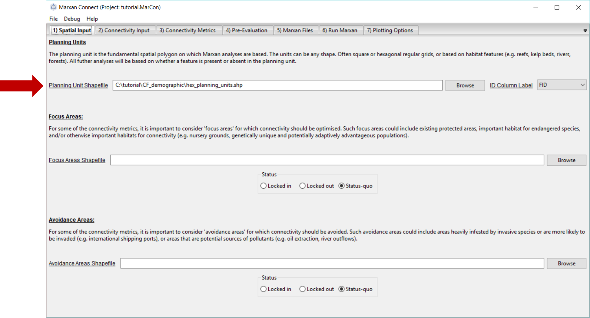
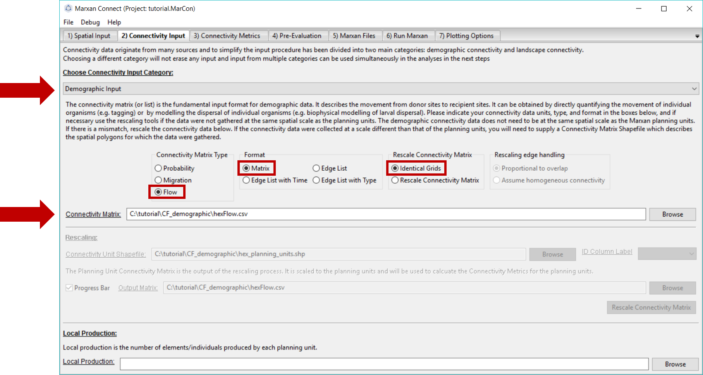
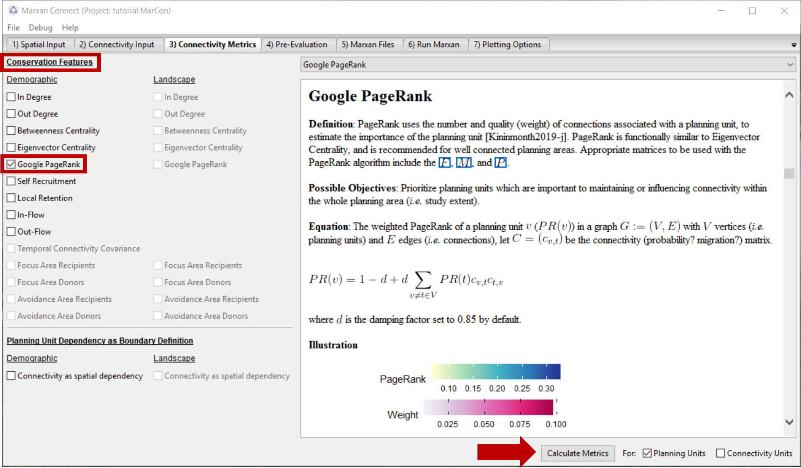
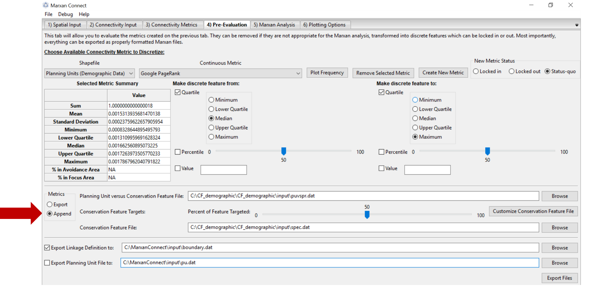
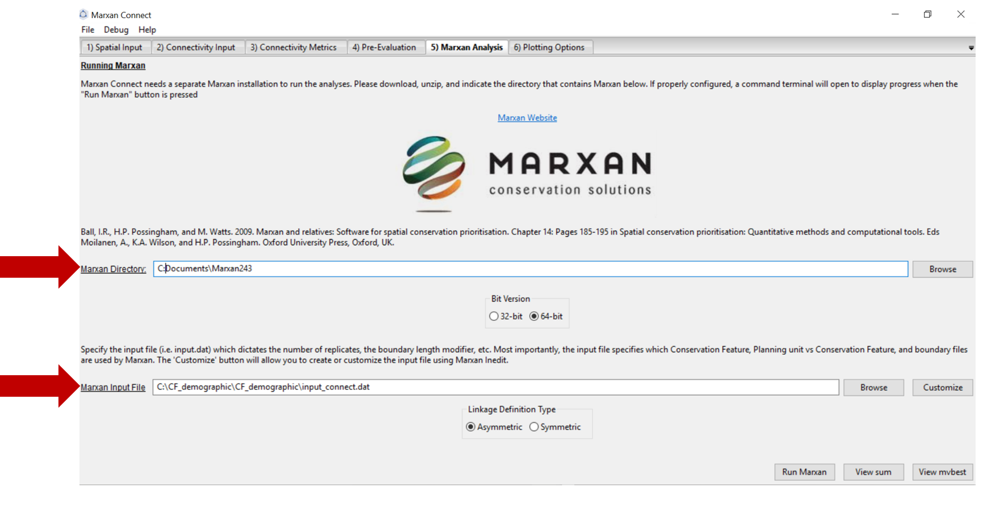

# Overview

The following section provides an example of a possible workflow using **demographic** connectivity data used as a **conservation feature**. It is important to note that these are indeed examples of the software's capabilities and are not intended to be used as scientific advice in a spatial conservation planning process. It is the user's responsibility to ensure that all analysis decisions are valid.

```{r load packages,message=FALSE, warning=FALSE}
# The maps and plots shown in this tutorial were created in R using the shapefile exported from the "Plotting Options" tab of Marxan Connect. The R code used to make the plots can be revealed by clicking on the `Code` button below

library(sf)

library(leaflet)

library(tmap)

library(tidyverse)

library(DT)

# set default projection for leaflet

proj <- "+proj=merc +a=6378137 +b=6378137 +lat_ts=0.0 +lon_0=0.0 +x_0=0.0 +y_0=0 +k=1.0 +units=m +nadgrids=@null +wktext  +no_defs"

```

# Input Data

Download the example [project folder](https://minhaskamal.github.io/DownGit/#/home?url=https://github.com/remi-daigle/MarxanConnect/tree/master/docs/tutorial/CF_demographic). This folder contains the Marxan Connect Project file, the input data, and the output data from this example.

Before opening Marxan Connect, let's manually look through the 'traditional' Marxan files (**spec.dat**, **puvspr.dat** and **pu.dat**) in the **input** folder of the **CF_demographic** folder, which contain only representation targets. The planning unit file (**hex_planning_units.shp**) includes hexagonal planning units that cover the Great Barrier Reef. We've identified a few bioregion types as our conservation features, for which we've set conservation targets.


## `spec.dat`

```{r}

spec <- read.csv("tutorial/CF_demographic/input/spec.dat")

datatable(spec,rownames = FALSE, options = list(searching = FALSE))

```

## `puvspr.dat`

The table shown here is a trimmed version showing the first 30 rows as an example of the type of data in the puvspr.dat file. The original dataset has 974 entries.

```{r}

puvspr <- read.csv("tutorial/CF_demographic/input/puvspr.dat")

datatable(puvspr[1:30,],rownames = FALSE, options = list(searching = FALSE))

```

## `pu.dat`

The table shown here is a trimmed version showing the first 30 rows as an example of the type of data in the pu.dat file. The original dataset has 653 entries.

```{r}

pu <- read.csv("tutorial/CF_demographic/input/pu.dat")

datatable(pu[1:30,],rownames = FALSE, options = list(searching = FALSE))

```

## Initial Conservation Feature

This map shows the bioregions, which serve as conservation features in the Marxan analysis with no connectivity.

```{r}

puvspr_wide <- puvspr %>%

left_join(select(spec,"id","name"),

by=c("species"="id")) %>%

select(-species) %>%

spread(key="name",value="amount")

# planning units with output

output <- read.csv("tutorial/CF_demographic/output/pu_no_connect.csv") %>%

mutate(geometry=st_as_sfc(geometry,"+proj=longlat +datum=WGS84"),

best_solution = as.logical(best_solution)) %>%

st_as_sf() %>%

left_join(puvspr_wide,by=c("FID"="pu"))

```

```{r,warning=FALSE,message=FALSE}

map <- leaflet(output) %>%

addTiles()

groups <- names(select(output,-best_solution,-select_freq, -fa_included, -aa_included, -google_demo_pu))[c(-1,-2)]

groups <- groups[groups!="geometry"]

for(i in groups){

z <- unlist(data.frame(output)[i])

if(is.numeric(z)){

pal <- colorBin("YlOrRd", domain = z)

}else{

pal <- colorFactor("YlOrRd", domain = z)

}

map = map %>%

addPolygons(fillColor = ~pal(z),

fillOpacity = 0.6,

weight=0.5,

color="white",

group=i,

label = as.character(z)) %>%

addLegend(pal = pal,

values = z,

title = i,

group = i,

position="bottomleft")

}

map <- map %>%

addLayersControl(overlayGroups  = groups,

options = layersControlOptions(collapsed = FALSE))

for(i in groups){

map <- map %>% hideGroup(i)

}

map %>%

showGroup("BIORE_102")

```

## Connectivity data

Now let's examine the spatial layers we've added in order to incorporate connectivity into the Marxan analysis. Marxan Connect needs a shapefile for the [planning units](glossary.html#5_planning_units), the [focus areas](glossary.html#4_focus_areas), and the [avoidance areas](glossary.html#4_focus_areas). These spatial layers are shown in the map below.

```{r load all layers for CF_demographic,results='hide'}

# planning units

pu <- st_read("tutorial/CF_demographic/hex_planning_units.shp") %>%

st_transform(proj)

#focus areas (IUCN level I or II protected areas)

fa <- st_read("tutorial/CF_demographic/IUCN_IorII.shp") %>%

st_transform(proj)

# avoidance areas (ports)

aa <- st_read("tutorial/CF_demographic/ports.shp") %>%

st_transform(proj)

```

```{r}

p <- qtm(pu,fill = '#7570b3') +

qtm(fa,fill = '#1b9e77') +

qtm(aa,fill = '#d95f02')

tmap_leaflet(p) %>%

addLegend(position = "topright",

labels = c("Planning Units","Focus Areas (IUCN I or II)","Avoidance Areas (ports)"),

colors = c("#7570b3","#1b9e77","#d95f02"),

title = "Layers")

```

## `connectivity_matrix.csv`

The connectivity data is at the 'heart' of Marxan Connect's functionality. It allows the generation of new conservation features based on connectivity metrics. 

The connectivity data for this analysis can be found in the **hexFlow.csv** file in the **CF_demographic** folder. For this example we have created the connectivity matrix for you. However, for demographic connectivity analyses, this file is user created from demographic data, tagging, etc. For landscape connectivity data, Marxan Connect does have some functionality to create connectivity matrices from resistance data (see landscape connectivity tutorial (./CSD_landscape.html)). 

For the sake of your web browser, this table only contains the 7 row and columns of the connectivity matrix. The real file has 653 X 653.

```{r}

conmat <- read.csv("tutorial/CF_demographic/hexFlow.csv",check.names = FALSE)[1:7,1:7]

datatable(conmat,rownames = FALSE, options = list(searching = FALSE))

```

# Marxan Connect

## Loading your project in Marxan Connect
 
Now that we have explored the input files, we are ready to open Marxan Connect and load our project. Please load the `tutorial.MarCon` file in the **CF_demographic** folder into Marxan Connect. You should not have to change any inputs in the project, but it is important to understand what these choices entail.


We will now step through the Marxan Connect workflow following the work flow tabs.


## Spatial Input

After loading `tutorial.MarCon` your **Spatial Input** tab should now look something like this:



Make sure that the **Planning Unit Shapefile**, **Focus Area Shapefile** and **Avoidance Area Shapefile** correspond to the appropriate input files. On this tab, you can also choose whether the **Focus Area Shapefile** and **Avoidance Areas Shapefile** should be locked in, locked out, or status-quo (i.e. the planning unit status stays the same as what is designated in the pu.dat file). In this example, our **Focus Areas** represents protected areas with IUCN categories I and II, and our **Avoidance Areas** represent ports. We have chosen to keep the same planning unit "status" (locked in/locked out) as the pu.dat file by selecting the status quo option.

Now we are ready to proceed to the **Connectivity Input** tab.

## Connectivity Input

Since we are working with demographic data, we choose the **Demographic Input** option from the **Choose Connectivity Input Category** dropdown menu. Alternatively, **Landscape Input** could be chosen (see landscape connectivity tutorial (./CSD_landscape.html)). 

On this tab, ensure that the **Connectivity Matrix** refers to the correct file. For this example, this should read **hexFlow.csv**. Since this data represents the _amount_ of movement between planning units (*i.e.* number of larvae) in a matrix format (*i.e.* a [flow](glossary.html#flow) matrix), we have selected the **Flow** Connectivity Matrix Type and the **Matrix** Format. 

Additionally, we have chosen the **Identical Grids** option from the **Rescale Connectivity Matrix** menu. This signifies that our connectivity data is on an identical grid as our planning units. If our connectivity data was not on the same grid as our planning units, we could chose to rescale the connectivity matrix, which essentially does a spatial averaging routine to calculate connectivity on the planning unit grid. If rescaling is chosen, the user needs to decide whether to rescale the connectivity data proportional to the overlap or to assume homogeneous connectivity. For example, if a planning unit has a 50% overlap with connectivity data (i.e. half of the planning unit has connectivity data, and the other half does not), and the connectivity value is 10, does the user want the connectivity value to be taken from a spatial average across that planning unit (i.e. the connectivity value of that planning unit would then be 5) or be considered homogenous across the planning unit (i.e. a connectivity value of 10).

Your **Connectivity Input** tab should look like this (you should not have to change any settings):



Now proceed to the **Connectivity Metrics** tab.

## Connectivity Metrics

In this example, we have chosen to use the **google page rank metric** as a Conservation Feature to incorporate connectivity, but there are a variety of options to choose from. The drop down menu in the top right corner gives definitions, possible objectives and the mathematical formulations for different conservation feature options.



Once you have selected a demographic conservation feature press **Calculate Metrics** and proceed to the **Pre-Evaluation** tab.

## Pre-Evaluation

This page allows you to evaluate the metrics created on the **Connectivity Metrics** tab in more detail. It also allows you to choose how you would like to transform the continuous connectivity metrics into conservation features for further analysis. To discretize the continuous metric, we've chosen the median of the continuous metric Google PageRank as lower threshold and the maximum value as the upper threshold. We are setting a target of 50% for this new discrete conservation feature, which means we are aiming to protect half of the planning units which had a Google PageRank score above the median.  In this example, we append the new connectivity based conservation metrics to the existing Marxan files by selecting **Append**  under the Metrics option box.

 

Once the desired options have been chosen, press **Export Files** in the bottom right corner of the screen. This will create two new files (or update the files, as they have already been created) called **puvspr_appended.dat** and **spec_appended.dat** in the **input** folder of the **CF_demographic** folder.

Let's examine the appended files.

### `spec_appended.dat`

Selecting the third page of the appended spec.dat file, you will find an additional row (21 in this example) with the target for this new connectivity based conservation feature.

```{r}

spec <- read.csv("tutorial/CF_demographic/input/spec_appended.dat")

datatable(spec,rownames = FALSE, options = list(searching = FALSE))

```

### `puvspr_appended.dat`

The table shown here is a trimmed version showing the first 30 rows as an example of the type of data in the puvspr_appended.dat file. The original dataset has 1627 entries.

Selecting the third page of the appended file, you will find additional rows (corresponding to our new conservation feature, which is 'species 21' in this example) with the amount of this feature in each planning unit.

```{r}

puvspr <- read.csv("tutorial/CF_demographic/input/puvspr_appended.dat")

datatable(puvspr[1:30,],rownames = FALSE, options = list(searching = FALSE))

```
## Marxan Analysis

Now that the necessary connectivity files have been created, We are ready to run Marxan Connect. Make sure that **Marxan Directory** is set to the location of your Marxan program (**Marxan.exe**), and that the **Marxan Input File** corresponds to the new **input_connect.dat** file. In this example, we have created the **input_connect.dat** file for you. However, when using your own data, you will need to create this file yourself (manually or with the 'customize' button that calls Marxan's 'inedit'), following the same format as the file that is provided.  Please see the traditional [Marxan documentation](http://marxan.net/userguides) for more information
 

To run Marxan Connect press the **Run Marxan** button in the bottom right corner of this tab. 

Running Marxan Connect with the connectivity conservation features results in the following Marxan solution:

```{r}

# planning units with output

output <- read.csv("tutorial/CF_demographic/output/pu_connect.csv") %>%

mutate(geometry=st_as_sfc(geometry,"+proj=longlat +datum=WGS84"),

best_solution = as.logical(best_solution),

fa_included = as.logical(gsub("True",TRUE,.$fa_included)),

aa_included = as.logical(gsub("True",TRUE,.$aa_included))) %>%

st_as_sf()

```

```{r,warning=FALSE,message=FALSE}

map <- leaflet(output) %>%

addTiles()

groups <- c("best_solution","select_freq")

for(i in groups){

z <- unlist(data.frame(output)[i])

if(is.numeric(z)){

pal <- colorBin("YlOrRd", domain = z)

}else{

pal <- colorFactor("YlOrRd", domain = z)

}

map = map %>%

addPolygons(fillColor = ~pal(z),

fillOpacity = 0.6,

weight=0.5,

color="white",

group=i,

label = as.character(z)) %>%

addLegend(pal = pal,

values = z,

title = i,

group = i,

position="bottomleft")

}

map <- map %>%

addLayersControl(overlayGroups  = groups,

options = layersControlOptions(collapsed = FALSE))

for(i in groups){

map <- map %>% hideGroup(i)

}

map %>%

showGroup("select_freq")

```

Here is the output of our example with no connectivity for comparison. 

```{r}

# planning units with output

output <- read.csv("tutorial/CF_demographic/output/pu_no_connect.csv") %>%

mutate(geometry=st_as_sfc(geometry,"+proj=longlat +datum=WGS84"),

best_solution = as.logical(best_solution),

fa_included = as.logical(gsub("True",TRUE,.$fa_included)),

aa_included = as.logical(gsub("True",TRUE,.$aa_included))) %>%

st_as_sf()

```

```{r,warning=FALSE,message=FALSE}

map <- leaflet(output) %>%

addTiles()

groups <- c("best_solution","select_freq")

for(i in groups){

z <- unlist(data.frame(output)[i])

if(is.numeric(z)){

pal <- colorBin("YlOrRd", domain = z)

}else{

pal <- colorFactor("YlOrRd", domain = z)

}

map = map %>%

addPolygons(fillColor = ~pal(z),

fillOpacity = 0.6,

weight=0.5,

color="white",

group=i,

label = as.character(z)) %>%

addLegend(pal = pal,

values = z,

title = i,

group = i,

position="bottomleft")

}

map <- map %>%

addLayersControl(overlayGroups  = groups,

options = layersControlOptions(collapsed = FALSE))

for(i in groups){

map <- map %>% hideGroup(i)

}

map %>%

showGroup("select_freq")

```

## Plotting Options

Here the users can plot up to two layers of input or output data on a built in basemap (provided by the [basemap](https://matplotlib.org/basemap/) package). The tab allows users to choose a few basic color, transparency, and legend positioning options, but this tab also allows users to export the output data in various formats to provide further plotting or analysis options.
