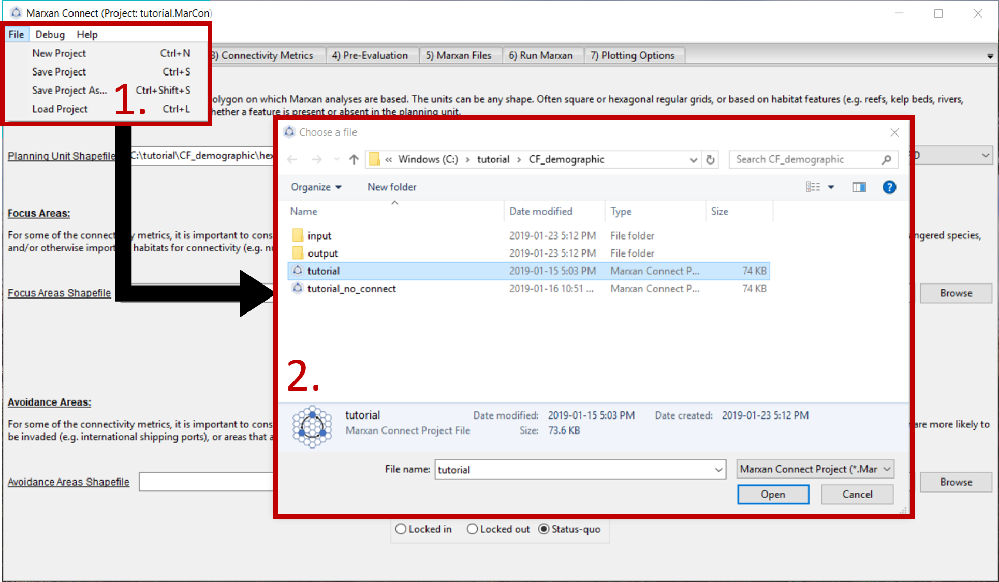
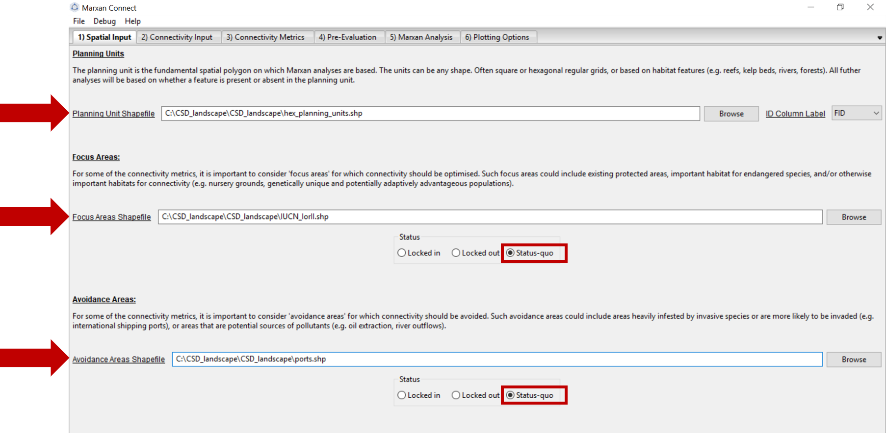
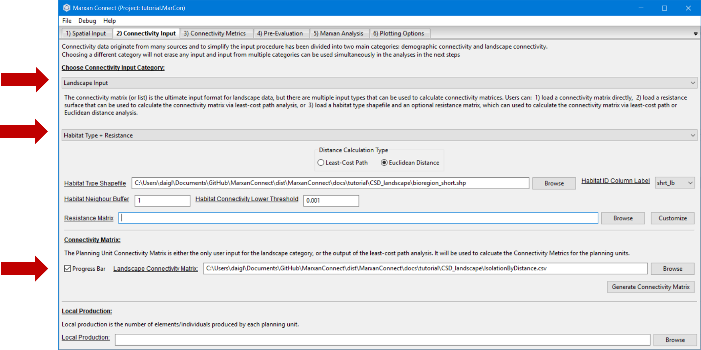
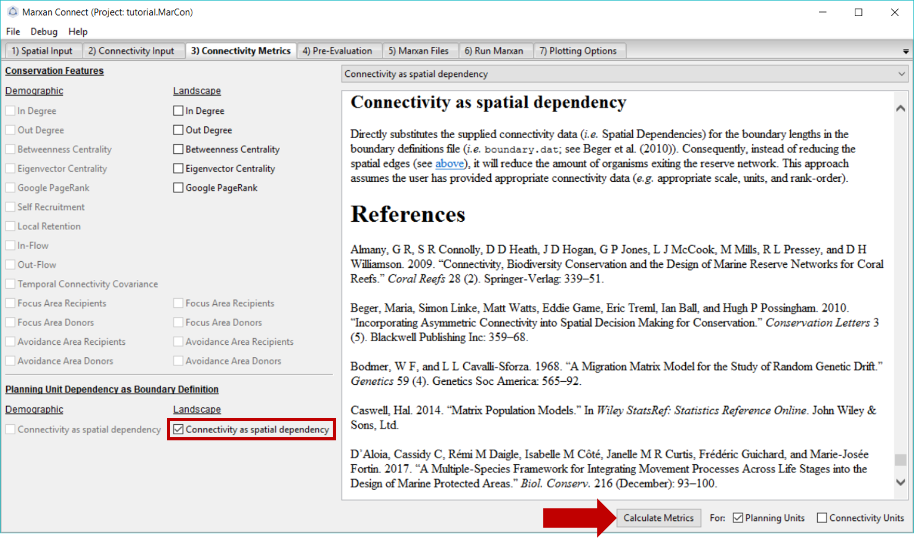
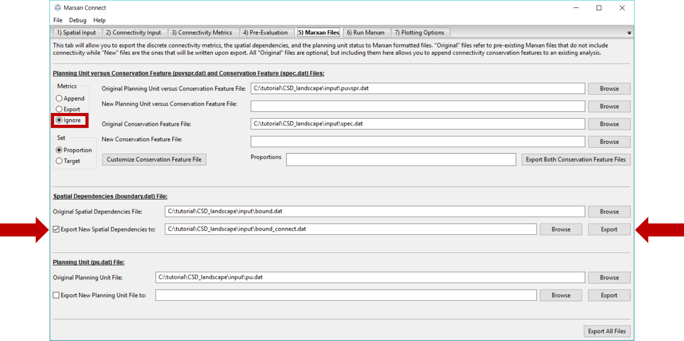
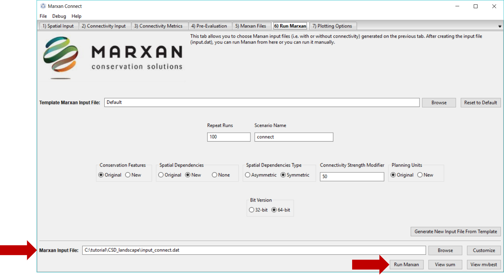

# Overview

The following section provides an example of a possible workflow using **landscape** connectivity data used as a conservation feature. It is important to note that these are indeed examples of the software's capabilities and are not intended to be used as scientific advice in a spatial conservation planning process. It is the user's responsibility to ensure that all analysis decisions are valid.

```{r load packages,message=FALSE, warning=FALSE}
# The maps and plots shown in this tutorial were created in R using the shapefile exported from the "Plotting Options" tab of Marxan Connect. The R code used to make the plots can be revealed by clicking on the `Code` button below

library(sf)

library(leaflet)

library(tmap)

library(tidyverse)

library(DT)

# set default projection for leaflet

proj <- "+proj=merc +a=6378137 +b=6378137 +lat_ts=0.0 +lon_0=0.0 +x_0=0.0 +y_0=0 +k=1.0 +units=m +nadgrids=@null +wktext  +no_defs"

```

# Input Data

Download the example [project folder](https://minhaskamal.github.io/DownGit/#/home?url=https://github.com/remi-daigle/MarxanConnect/tree/master/docs/tutorial/CSD_landscape). This folder contains the Marxan Connect Project file, the input data, and the output data from this example. 

Before opening Marxan Connect, let's manually look through the 'traditional' Marxan files (**spec.dat**, **puvspr.dat** and **pu.dat**) in the **input** folder of the **CSD_landscape** folder, which contain only representation targets. The planning unit file (**hex_planning_units.shp**) includes hexagonal planning units that cover the Great Barrier Reef. We've identified a few bioregion types as our conservation features, for which we've set conservation targets.

## `spec.dat`

```{r}

spec <- read.csv("tutorial/CSD_landscape/input/spec.dat")

datatable(spec,rownames = FALSE, options = list(searching = FALSE))

```

## `puvspr.dat`

The table shown here is a trimmed version showing the first 30 rows as an example of the type of data in the puvspr.dat file. The original dataset has 974 entries.

```{r}

puvspr <- read.csv("tutorial/CSD_landscape/input/puvspr.dat")

datatable(puvspr[1:30,],rownames = FALSE, options = list(searching = FALSE))

```

## `pu.dat`

The table shown here is a trimmed version showing the first 30 rows as an example of the type of data in the puvspr.dat file. The original dataset has 653 entries.

```{r}

pu <- read.csv("tutorial/CSD_landscape/input/pu.dat")

datatable(pu[1:30,],rownames = FALSE, options = list(searching = FALSE))

```

## Inital Conservation Features

This map shows the bioregions, which serve as conservation features in the Marxan analysis with no connectivity.

```{r}

puvspr_wide <- puvspr %>%

left_join(select(spec,"id","name"),

by=c("species"="id")) %>%

select(-species) %>%

spread(key="name",value="amount")

# planning units with output

output <- read.csv("tutorial/CSD_landscape/output/pu_no_connect.csv") %>%

mutate(geometry=st_as_sfc(geometry,"+proj=longlat +datum=WGS84"),

best_solution = as.logical(best_solution)) %>%

st_as_sf() %>%

left_join(puvspr_wide,by=c("FID"="pu"))

```

```{r,warning=FALSE,message=FALSE}

map <- leaflet(output) %>%

addTiles()

groups <- names(select(output,-best_solution,-select_freq))[c(-1,-2)]

groups <- groups[groups!="geometry"]

for(i in groups){

z <- unlist(data.frame(output)[i])

if(is.numeric(z)){

pal <- colorBin("YlOrRd", domain = z)

}else{

pal <- colorFactor("YlOrRd", domain = z)

}

map = map %>%

addPolygons(fillColor = ~pal(z),

fillOpacity = 0.6,

weight=0.5,

color="white",

group=i,

label = as.character(z)) %>%

addLegend(pal = pal,

values = z,

title = i,

group = i,

position="bottomleft")

}

map <- map %>%

addLayersControl(overlayGroups  = groups,

options = layersControlOptions(collapsed = FALSE))

for(i in groups){

map <- map %>% hideGroup(i)

}

map %>%

showGroup("BIORE_102")

```

## Adding Connectivity

Now let's examine the spatial layers we've added in order to incorporate connectivity into the Marxan analysis. Marxan Connect needs a shapefile for the [planning units](glossary.html#5_planning_units), the [focus areas](glossary.html#4_focus_areas), and the [avoidance areas](glossary.html#4_focus_areas). These spatial layers are shown in the map below.

```{r load all layers for CSD_landscape,results='hide'}

# planning units

pu <- st_read("tutorial/CSD_landscape/hex_planning_units.shp") %>%

st_transform(proj)

#focus areas (IUCN level I or II protected areas)

fa <- st_read("tutorial/CSD_landscape/IUCN_IorII.shp") %>%

st_transform(proj)

# avoidance areas (ports)

aa <- st_read("tutorial/CSD_landscape/ports.shp") %>%

st_transform(proj)

```

```{r}

p <- qtm(pu,fill = '#7570b3') +

qtm(fa,fill = '#1b9e77') +

qtm(aa,fill = '#d95f02')

tmap_leaflet(p) %>%

addLegend(position = "topright",

labels = c("Planning Units","Focus Areas (IUCN I or II)","Avoidance Areas (ports)"),

colors = c("#7570b3","#1b9e77","#d95f02"),

title = "Layers")

```

### `connectivity_matrix.csv`

The connectivity data is at the 'heart' of Marxan Connect's functionality. It allows the generation of new conservation features based on connectivity metrics.

The connectivity data for this analysis can be found in the **IsolationByDistance.csv** file in the **CSD_landscape** folder. This connectivity data was generated by Marxan Connect and represents the _proportion_ of those individuals _originating_ from a donor planning unit (which contains a particular habitat type) which arrive into a recipient planning unit (which contains a that same habitat type)  (*i.e.* a [probability](glossary.html#probability) matrix) in a [edge list with type](glossary.html#edge_list_with_type) (*i.e.* habitat type) format. The connectivity data generating procedure is described in more detail in the [Connectivity Input](CSD_landscape.html#connectivity_input) section. Below is the connectivity matrix of our example conservation priority. For the sake of you web browser, this table only contains the 7 row and columns of the connectivity matrix. The real file has 1279227 entries.

```{r}

conmat <- read.csv("tutorial/CSD_landscape/IsolationByDistance.csv")

datatable(conmat[1:7,],rownames = FALSE, options = list(searching = FALSE))

```

# Marxan Connect

## Loading your project in Marxan Connect
 
 Now that we have explored the input files, we are ready to open Marxan Connect and load our project. Please load the `tutorial.MarCon` file in the **CSD_landscape** folder into Marxan Connect. You should not have to change any inputs in the project, but it is important to understand what these choices entail.
 


We will now step through the Marxan Connect workflow following the work flow tabs.


## Spatial Input

After loading `tutorial.MarCon` your **Spatial Input** tab should now look something like this:



Make sure that the **Planning Unit Shapefile**, **Focus Area Shapefile** and **Avoidance Area Shapefile** correspond to the appropriate input files. On this tab, you can also choose whether the **Focus Area Shapefile** and **Avoidance Areas Shapefile** should be locked in, locked out, or status-quo (i.e. the planning unit status stays the same as what is designated in the pu.dat file). In this example, our **Focus Areas** represents protected areas with IUCN categories I and II, and our **Avoidance Areas** represent ports. We have chosen to keep the same planning unit "status" (locked in/locked out) as the pu.dat file by selecting the status quo option.

Now we are ready to proceed to the **Connectivity Input** tab.

## Connectivity Input

Since we are working with landscape data, we choose the **Landscape Input** option from the **Choose Connectivity Input Category** dropdown menu. Alternatively, **Demographic Input** could be chosen (see [demographic connectivity tutorial ](./CF_demographic.html)). 

For the landscape connectivity approach, Marxan Connect calculates connectivity metrics from networks based either on Euclidean distance or least-cost path between the centroid of planning units. However, other software packages such as [Circuitscape](http://www.circuitscape.org/) [@McRae2009-aq] and [Conefor](http://www.conefor.org/) [@Saura2009-sa] currently provide a richer set of options and specialized  methods. These software packages can be used to generate custom conservation features or connectivity matrices both of which can then be used in Marxan Connect. For example, one could generate a network using current density using Circuitscape and input the resulting connectivity matrix into Marxan Connect to generate conservation features or spatial dependencies.

The connectivity data we use in this example was created by Marxan Connect by calculating using the "**Habitat Type +Resistance**" options. We selected the "**Euclidean Distance**" Distance Calculation Type to estimate the connectivity between each planning unit. We selected the **bioregion_short.shp** as the **Habitat Type Shapefile** so that pairs of planning units which contain the same habitat type are connected while others are not. The probability of connectivity then becomes ${1/distance^2}$, if pairs of planning units which contain the same habitat type, normalized for each source planning unit so that the sum of probabilities is 1 (*i.e.* row normalized). The **Habitat Neighbour Buffer**, in this case set to 1 m, is the maximum distance in meters where neighbouring planning units could be considered directly connected. The **Habitat Connectivity Lower Threshold** is the value below which connectivity links are considered negligible and set to 0. However, since this whole process is fairly time consuming we've provided the pre-calculated matrix. 

Ensure that the **Connectivity Matrix** refers to the correct file. For this example, this should read **IsolationByDistance.csv**.

Your **Connectivity Input** tab should look like this (you should not have to change any settings):



Now proceed to the **Connectivity Metrics** tab.

## Connectivity Metrics

In this example, we have chosen to incorporate landscape connectivity data as the spatial dependencies between planning units, and therefore, have selected the **Connectivity as boundary** option in the **Planning Unit Dependency as Boundary Definition** section.  This option directly substitutes the supplied connectivity data (_i.e._ Spatial Dependencies) for the boundary lengths in the boundary definitions file (_i.e._ `boundary.dat`; see Beger et al. (2010)), and assumes the user has provided appropriate connectivity data (_e.g._ appropriate scale, units, and rank-order). 

Alternatively, landscape connectivity data could be incorporated as a discrete conservation feature. The drop down menu in the top right corner gives definitions, possible objectives and the mathematical formulations for different conservation feature options.  See [demographic connectivity tutorial ](./CF_demographic.html) for more information.



Once you have selected the appropriate landscape connectivity inputs press **Calculate Metrics** and proceed to the **Pre-Evaluation** tab.

## Pre-Evaluation

This page allows you to evaluate the metrics created on the **Connectivity Metrics** tab in more detail. It also allows you to choose how you would like to create the connectivity metrics file for further analysis. In this example, we've chosen to append the new connectivity based conservation metrics to the existing Marxan files by selecting **Append**  under the Metrics option box, but since you're not adding any new conservation features Export and Append are equivalent.



Once the desired options have been chosen, press **Export Files** in the bottom right corner of the screen. This will create a new boundary file (**boundary.dat**) that incorporates the landscape connectivity metrics (or update the files, as it has already been created) in the **input** folder of the **CSD_landscape** folder.

Let's examine the appended file.

## `boundary.dat`

Locate the **boundary.dat** file that was created in your Marxan directory folder. This file should look like the table below, which
### `boundary.dat`

This table represents the spatial dependencies  between planning units as the values in the connectivity matrix from above (**IsolationByDistance.csv**) above (*i.e.* connectivity strength instead of boundary length).

The table shown here is a trimmed version showing the first 30 rows as an example of the type of data in the **boundary.dat ** file. The original dataset has 38648 entries.

```{r}

boundary <- read.csv("tutorial/CSD_landscape/input/boundary.dat")

datatable(boundary[1:30,],rownames = FALSE, options = list(searching = FALSE))

```
## Marxan Analysis

Now that the necessary connectivity files have been created, We are ready to run Marxan Connect. Make sure that **Marxan Directory** is set to the location of your Marxan program (**Marxan.exe**), and that the **Marxan Input File** corresponds to the new **input_connect.dat** file. In this example, we have created the **input_connect.dat** file for you. However, when using your own data, you will need to create this file yourself (manually or with the 'customize' button that calls Marxan's 'inedit'), following the same format as the file that is provided.  

 

To run Marxan Connect press the **Run Marxan** button in the bottom right corner of this tab. 
Finally, running Marxan with the connectivity conservation features and boundary definitions results in the following Marxan different solution:.

```{r}

# planning units with output

output <- read.csv("tutorial/CSD_landscape/output/pu_connect.csv") %>%

mutate(geometry=st_as_sfc(geometry,"+proj=longlat +datum=WGS84"),

best_solution = as.logical(best_solution),

# fa_included = as.logical(gsub("True",TRUE,.$fa_included)),

# aa_included = as.logical(gsub("True",TRUE,.$aa_included))

) %>%

st_as_sf()

```

```{r,warning=FALSE,message=FALSE}

map <- leaflet(output) %>%

addTiles()

groups <- c("best_solution","select_freq")

for(i in groups){

z <- unlist(data.frame(output)[i])

if(is.numeric(z)){

pal <- colorBin("YlOrRd", domain = z)

}else{

pal <- colorFactor("YlOrRd", domain = z)

}

map = map %>%

addPolygons(fillColor = ~pal(z),

fillOpacity = 0.6,

weight=0.5,

color="white",

group=i,

label = as.character(z)) %>%

addLegend(pal = pal,

values = z,

title = i,

group = i,

position="bottomleft")

}

map <- map %>%

addLayersControl(overlayGroups  = groups,

options = layersControlOptions(collapsed = FALSE))

for(i in groups){

map <- map %>% hideGroup(i)

}

map %>%

showGroup("select_freq")

```

Here is the output of our example with no connectivity for comparison.

```{r}

# planning units with output

output <- read.csv("tutorial/CSD_landscape/output/pu_no_connect.csv") %>%

mutate(geometry=st_as_sfc(geometry,"+proj=longlat +datum=WGS84"),

best_solution = as.logical(best_solution),

# fa_included = as.logical(gsub("True",TRUE,.$fa_included)),

# aa_included = as.logical(gsub("True",TRUE,.$aa_included))

) %>%

st_as_sf()

```

```{r,warning=FALSE,message=FALSE}

map <- leaflet(output) %>%

addTiles()

groups <- c("best_solution","select_freq")

for(i in groups){

z <- unlist(data.frame(output)[i])

if(is.numeric(z)){

pal <- colorBin("YlOrRd", domain = z)

}else{

pal <- colorFactor("YlOrRd", domain = z)

}

map = map %>%

addPolygons(fillColor = ~pal(z),

fillOpacity = 0.6,

weight=0.5,

color="white",

group=i,

label = as.character(z)) %>%

addLegend(pal = pal,

values = z,

title = i,

group = i,

position="bottomleft")

}

map <- map %>%

addLayersControl(overlayGroups  = groups,

options = layersControlOptions(collapsed = FALSE))

for(i in groups){

map <- map %>% hideGroup(i)

}

map %>%

showGroup("select_freq")

```

## Plotting Options

Here the users can plot up to two layers of input or output data on a built in basemap (provided by the [basemap](https://matplotlib.org/basemap/) package). The tab allows users to choose a few basic color, transparency, and legend positioning options, but this tab also allows users to export the output data in various formats to provide further plotting or analysis options.
