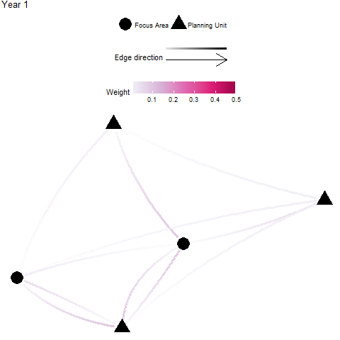

```{r load packages,message=FALSE, warning=FALSE, echo=FALSE}
library(igraph)
library(tidyverse)
library(ggraph)
library(gganimate)
library(tidygraph)
library(RColorBrewer)
```

# Avoidance Areas

For some of the connectivity metrics (e.g. Avoidance Area Recipients), it is important to consider 'avoidance areas' for which connectivity should be considered. Examples of such avoidance areas are planning units that are heavily infested or more likely to be invaded by invasive species (*e.g.* international shipping ports), or areas that are potential sources of pollutants (*e.g.* oil extraction, river outflows). Marxan Connect does not make assumptions regarding the protection of such planning units. Loading avoidance areas into Marxan Connect allows users to set conservation targets for other areas that complement focus areas, or to "lock-out" (fixed out of the final reserve) the planning units which are overlap the avoidance area.

# Conservation Feature

Marxan Connect can calculate various network metrics (e.g. betweeness centrality) and several several ecologically meaningful measures (e.g., out-flow), which can be used as conservation features in Marxan.

It should be noted that both approaches of incorporating connectivity into Marxan (as conservation features or as an [spatial dependency](glossary.html#spatial-dependency)) can be used alone or in combination, but some combinations may be redundant or inapporpriate (e.g. eigenvector centrality as a conservation feature and connectivity-based spatial dependencies) and we encourage careful consideration. In all cases, an appropriate level of sensitivity testing should be completed to help with interpretation and communication of outcomes. 


## In-Degree

**Definition**: In-degree indicates the number of connections coming into each planning unit [@Minor2007-fb]. This metric ignores edge weights or strengths, and can be calculated from [${F}$](glossary.html#flow), [${M}$](glossary.html#migration), or [${P}$](glossary.html#probability) .

**Possible Objectives**: Prioritize planning units which receive input from a larger number of other planning units. The recipient planning units with a high In-degree may have higher genetic diversity [@Almany2009-vt; @Munguia-Vega2015-rh], species diversity and population resilience through greater rescue potential [@Hanski1982-kw] as a result of the high in number of incoming connections. However, planning units with high In-degree may be susceptible to outbreaks and invasive species [*e.g.* @Hock2014-or]

**Equation**: The in degree of a planning unit ${v}$ (${ID(v)}$) in a graph ${G:=(V,E)}$ with ${V}$ vertices (*i.e.* planning units) and ${E}$ edges (*i.e.* connections).

$${\displaystyle ID(v) = deg^{-}(v)}$$

where ${deg^{-}(v)}$ is the number if inward pointing ${E}$ for planning unit ${v}$.

**Illustration**

```{r,message=FALSE, echo=FALSE, fig.width=5, fig.height = 5}
PU <- LETTERS[1:5]
AdjacencyMatrix <- matrix(data = c(FALSE,FALSE,FALSE,TRUE,FALSE,
                                   TRUE,FALSE,FALSE,FALSE,TRUE,
                                   TRUE,TRUE,FALSE,TRUE,TRUE,
                                   FALSE,TRUE,FALSE,FALSE,TRUE,
                                   FALSE,TRUE,FALSE,TRUE,FALSE),
                          nrow = 5,
                          ncol = 5,
                          dimnames = list(PU,PU))

G <- graph_from_adjacency_matrix(AdjacencyMatrix)
V(G)$metric <- igraph::degree(G,mode = "in")

ggraph(as_tbl_graph(G),layout="fr") + 
    geom_edge_fan(aes(alpha = ..index..), start_cap = circle(4, 'mm'), end_cap = circle(4, 'mm'), edge_width = 1.25) + 
    scale_edge_alpha('Edge direction', guide = 'edge_direction') +
    geom_node_point(aes(colour = metric),size = 8) + 
    scale_colour_gradientn(name="In Degree", colours = brewer.pal(5,"YlGnBu"),guide = guide_colorbar(barwidth=10)) +
    theme_void() + theme(legend.position="top",legend.box="vertical")
```

## Out-Degree

**Definition**: Out degree indicates the number of connections originating from each planning unit [@Minor2007-fb]. This metric ignores edge weights or strengths, and can be calculated from [${F}$](glossary.html#flow), [${M}$](glossary.html#migration), or [${P}$](glossary.html#probability).  

**Possible Objectives**: Prioritize for planning units which have a high number of connections going out to other planning units. Out-degree is often seen as a proxy for 'influence', where a high out-degree signifies a larger influence on many other units (*e.g.* a higher likelihood to rescue many other sites). Units with an extremely high out-degree are considered hubs and may have a influence on local and network-wide dynamics.

**Equation**: The in degree of a planning unit ${v}$ (${OD(v)}$) in a graph ${G:=(V,E)}$ with ${V}$ vertices (*i.e.* planning units) and ${E}$ edges (*i.e.* connections).

$${\displaystyle OD(v) = deg^{+}(v)}$$

where ${deg^{+}(v)}$ is the number of outward pointing ${E}$ for planning unit ${v}$.

**Illustration**

```{r,message=FALSE, echo=FALSE, fig.width=5, fig.height = 5}
PU <- LETTERS[1:5]
AdjacencyMatrix <- matrix(data = c(FALSE,FALSE,FALSE,TRUE,FALSE,
                                   TRUE,FALSE,FALSE,FALSE,TRUE,
                                   TRUE,TRUE,FALSE,TRUE,TRUE,
                                   FALSE,TRUE,FALSE,FALSE,TRUE,
                                   FALSE,TRUE,FALSE,TRUE,FALSE),
                          nrow = 5,
                          ncol = 5,
                          dimnames = list(PU,PU))

G <- graph_from_adjacency_matrix(AdjacencyMatrix)
V(G)$metric <- igraph::degree(G,mode = "out")

ggraph(as_tbl_graph(G),layout="fr") + 
    geom_edge_fan(aes(alpha = ..index..), start_cap = circle(4, 'mm'), end_cap = circle(4, 'mm'), edge_width = 1.25) + 
    scale_edge_alpha('Edge direction', guide = 'edge_direction') +
    geom_node_point(aes(colour = metric),size = 8) + 
    scale_colour_gradientn(name="Out Degree", colours = brewer.pal(5,"YlGnBu"),guide = guide_colorbar(barwidth=10)) +
    theme_void() + theme(legend.position="top",legend.box="vertical")
```

## Betweenness Centrality 

**Definition**: Betweenness centrality is a measure of the relative number of all shortest paths across a network (i.e., between all possible pairs of planning units) that pass through the focal planning unit [@Minor2007-fb]. Here, every edge (*i.e.* connection), irrespective of strength, is given a length of 1.  This metric ignores edge weights or strengths, and can be calculated from [${F}$](glossary.html#flow), [${M}$](glossary.html#migration), or [${P}$](glossary.html#probability).

**Possible Objectives**: Prioritize planning units which may act as important stepping stones among other planning units (those that have a high betweenness centrality).

**Equation**: The betweenness centrality of a planning unit ${v}$ (${BC(v)}$) in a graph ${G:=(V,E)}$ with ${V}$ vertices (*i.e.* planning units) and ${E}$ edges (*i.e.* connections) is

$$\displaystyle {BC(v)= \sum_{s \ne v \ne t \in V}\frac{{\sigma_{st}(v)}}{\sigma_{st}}}$$

where ${\sigma _{st}}$ is total number of shortest paths from planning unit ${s}$ to planning unit ${t}$ and ${\sigma _{st}(v)}$ is the number of those paths that pass through ${v}$.

**Illustration**

```{r,message=FALSE, echo=FALSE, fig.width=5, fig.height = 5}
PU <- LETTERS[1:5]
AdjacencyMatrix <- matrix(data = c(FALSE,FALSE,FALSE,TRUE,FALSE,
                                   TRUE,FALSE,FALSE,FALSE,TRUE,
                                   TRUE,TRUE,FALSE,TRUE,TRUE,
                                   FALSE,TRUE,FALSE,FALSE,TRUE,
                                   FALSE,TRUE,FALSE,TRUE,FALSE),
                          nrow = 5,
                          ncol = 5,
                          dimnames = list(PU,PU))

G <- graph_from_adjacency_matrix(AdjacencyMatrix)
V(G)$metric <- igraph::betweenness(G)

ggraph(as_tbl_graph(G),layout="fr") + 
    geom_edge_fan(aes(alpha = ..index..), start_cap = circle(4, 'mm'), end_cap = circle(4, 'mm'), edge_width = 1.25) + 
    scale_edge_alpha('Edge direction', guide = 'edge_direction') +
    geom_node_point(aes(colour = metric),size = 8) + 
    scale_colour_gradientn(name="Betweenness Centrality", colours = brewer.pal(5,"YlGnBu"),guide = guide_colorbar(barwidth=10)) +
    theme_void() + theme(legend.position="top",legend.box="vertical")
```

## Eigenvector Centrality

**Definition**: Eigenvector centrality indicates the influence (considers number of connections and their weight) that a planning unit has on the network [@DAloia2017-jp]. This metric requires appropriate edge weights or strengths, and should only be calculated from a properly structured migration matrix, [${M}$](glossary.html#migration). Eigenvector centrality is functionally similar to Google PageRank, but Eigenvector centrality is limited by the required matrix and the algorithm used to calculate it will not perform well with sparsely connected network. 

**Possible Objectives**: Prioritize planning units which are important to maintaining or influencing connectivity dynamics across the whole planning area (*i.e.* study extent).

**Equation**: The Eigenvector centrality of a planning unit ${v}$ (${EVC(v)}$) in a graph ${G:=(V,E)}$ with ${V}$ vertices (*i.e.* planning units) and ${E}$ edges (*i.e.* connections), let ${C=(c_{v,t})}$ be the connectivity (migration) matrix

$${\displaystyle EVC(v) =  \frac{1}{\lambda} \sum_{t \in G} c_{v,t}}$$

where ${\lambda }$ is the leading eigenvalue.

**Illustration**

```{r,message=FALSE, warning=FALSE, echo=FALSE, fig.width=5, fig.height = 6}
PU <- LETTERS[1:5]
AdjacencyMatrix <- matrix(data = c(0,0,0,0.01,0,
                                   0.1,0,0,0,0.1,
                                   0.01,0.05,0,0.01,0.01,
                                   0,0.01,0,0,0.05,
                                   0,0.1,0,0.1,0),
                          nrow = 5,
                          ncol = 5,
                          dimnames = list(PU,PU))

G <- graph_from_adjacency_matrix(AdjacencyMatrix, weighted=TRUE)
V(G)$metric <- igraph::eigen_centrality(G,directed = TRUE)$vector

ggraph(as_tbl_graph(G),layout="fr") + 
    geom_edge_fan(aes(colour=weight,alpha = ..index..), start_cap = circle(4, 'mm'), end_cap = circle(4, 'mm'), edge_width = 1.25) + 
    scale_edge_colour_gradientn("Weight",colours=brewer.pal(5,"PuRd"),guide = guide_edge_colourbar(barwidth = 10))+
    scale_edge_alpha('Edge direction', guide = 'edge_direction') +
    geom_node_point(aes(colour = metric),size = 8) + 
    scale_colour_gradientn(name="Eigenvector Centrality", colours = brewer.pal(5,"YlGnBu"),guide = guide_colorbar(barwidth=10)) +
    theme_void() + theme(legend.position="top",legend.box="vertical")
```

## Google PageRank

**Definition**: PageRank uses the number and quality (weight) of connections associated with a planning unit, to estimate the importance of the planning unit [@Kininmonth2019-jl]. PageRank is functionally similar to Eigenvector Centrality, and is recommended for well connected planning areas. Appropriate matrices to be used with the PageRank algorithm include the [${F}$](glossary.html#flow), [${M}$](glossary.html#migration), or [${P}$](glossary.html#probability).  

**Possible Objectives**: Prioritize planning units which are important to maintaining or influencing connectivity within the whole planning area (*i.e.* study extent).

**Equation**: The weighted PageRank of a planning unit ${v}$ (${PR(v)}$) in a graph ${G:=(V,E)}$ with ${V}$ vertices (*i.e.* planning units) and ${E}$ edges (*i.e.* connections), let ${C=(c_{v,t})}$ be the connectivity (probability? migration?) matrix.

$$\displaystyle PR(v) = 1-d+d\sum_{v\ne t\in V}PR(t)c_{v,t}c_{t,v}$$

where $d$ is the damping factor set to 0.85 by default.

**Illustration**

```{r,message=FALSE, warning=FALSE, echo=FALSE, fig.width=5, fig.height = 6}
PU <- LETTERS[1:5]
AdjacencyMatrix <- matrix(data = c(0,0,0,0.01,0,
                                   0.1,0,0,0,0.1,
                                   0.01,0.05,0,0.01,0.01,
                                   0,0.01,0,0,0.05,
                                   0,0.1,0,0.1,0),
                          nrow = 5,
                          ncol = 5,
                          dimnames = list(PU,PU))

G <- graph_from_adjacency_matrix(AdjacencyMatrix, weighted=TRUE)
V(G)$metric <- igraph::page.rank(G,directed = TRUE)$vector

ggraph(as_tbl_graph(G),layout="fr") + 
    geom_edge_fan(aes(colour=weight,alpha = ..index..), start_cap = circle(4, 'mm'), end_cap = circle(4, 'mm'), edge_width = 1.25) + 
    scale_edge_colour_gradientn("Weight",colours=brewer.pal(5,"PuRd"),guide = guide_edge_colourbar(barwidth = 10))+
    scale_edge_alpha('Edge direction', guide = 'edge_direction') +
    geom_node_point(aes(colour = metric),size = 8) + 
    scale_colour_gradientn(name="PageRank", colours = brewer.pal(5,"YlGnBu"),guide = guide_colorbar(barwidth=10)) +
    theme_void() + theme(legend.position="top",legend.box="vertical")
```

## Self-Recruitment

**Definition**: Self-recruitment is the diagonal of the migration matrix, [M]. It is the proportion of individuals that arrived to a planning unit that originated from that same planning unit [see @DAloia2017-jp; @Lett2015-wv].

**Possible Objectives**: Prioritize planning units which are dominated by locally-produced individuals. A high self-recruitment value may indicate a greater degree of isolation. Note that it should be used cautiously, as high self recruitment does not equate high recruitment (*e.g.* a planning unit can be 100% self-recruiting when only one individual arrives, which also originated from that unit).  

**Equation**: The self recruitment of a planning unit ${v}$ (${SR(v)}$) in a graph ${G:=(V,E)}$ with ${V}$ vertices (*i.e.* planning units) and ${E}$ edges (*i.e.* connections), let ${C=(c_{v,t})}$ be the connectivity (probability) matrix.

$${\displaystyle SR(v) = \frac{c_{v,v}N_v}{\sum_{t \in V}c_{t,v}N_v}}$$

where ${N_v}$ is the number of potential recruits produced in planning unit ${t}$.

**Illustration**

```{r,message=FALSE, warning=FALSE, echo=FALSE, fig.width=5, fig.height=6}
PU <- LETTERS[1:5]
AdjacencyMatrix <- matrix(data = c(0,0,0,0,0,
                                   0,0.1,0,0,0,
                                   0,0,0.05,0,0,
                                   0,0,0,0.001,0,
                                   0,0,0,0,0.001),
                          nrow = 5,
                          ncol = 5,
                          dimnames = list(PU,PU))

G <- graph_from_adjacency_matrix(AdjacencyMatrix, weighted=TRUE)
V(G)$metric <- diag(AdjacencyMatrix)

ggraph(as_tbl_graph(G),layout="fr") + 
    geom_edge_loop(aes(colour=weight,alpha = ..index..), start_cap = circle(4, 'mm'), end_cap = circle(4, 'mm'), edge_width = 1.25) + 
    scale_edge_colour_gradientn("Weight",colours=brewer.pal(5,"PuRd"),guide = guide_edge_colourbar(barwidth = 10))+
    scale_edge_alpha('Edge direction', guide = 'edge_direction') +
    geom_node_point(aes(colour = metric),size = 8) + 
    scale_colour_gradientn(name="Self Recruitment", colours = brewer.pal(5,"YlGnBu"),guide = guide_colorbar(barwidth=10)) +
    theme_void() + theme(legend.position="top",legend.box="vertical")
```

## Local Retention

**Definition**: Local retention is the diagonal of the probability matrix, [P], and is the proportion of those individuals originating from a planning unit that are retained within that planning unit. Therefore, this value is independent of contributions from all other planning units [@Lett2015-wv]. 

**Possible Objectives**: Prioritize planning units which retain a large proportion of the individuals produced. This may be used as a proxy for the planning unit to be self-sustaining (@Burgess2014-mf).

**Equation**: The local retention of a planning unit ${v}$ (${LR(v)}$) in a graph ${G:=(V,E)}$ with ${V}$ vertices (*i.e.* planning units) and ${E}$ edges (*i.e.* connections), let ${C=(c_{v,t})}$ be the connectivity (probability) matrix.

$$\displaystyle LR(v) = c_{v,v}$$

**Illustration**

```{r,message=FALSE, warning=FALSE, echo=FALSE, fig.width=5, fig.height=6}
PU <- LETTERS[1:5]
AdjacencyMatrix <- matrix(data = c(0,0,0,0,0,
                                   0,0.1,0,0,0,
                                   0,0,0.05,0,0,
                                   0,0,0,0.001,0,
                                   0,0,0,0,0.001),
                          nrow = 5,
                          ncol = 5,
                          dimnames = list(PU,PU))

G <- graph_from_adjacency_matrix(AdjacencyMatrix, weighted=TRUE)
V(G)$metric <- diag(AdjacencyMatrix)

ggraph(as_tbl_graph(G),layout="fr") + 
    geom_edge_loop(aes(colour=weight,alpha = ..index..), start_cap = circle(4, 'mm'), end_cap = circle(4, 'mm'), edge_width = 1.25) + 
    scale_edge_colour_gradientn("Weight",colours=brewer.pal(5,"PuRd"),guide = guide_edge_colourbar(barwidth = 10))+
    scale_edge_alpha('Edge direction', guide = 'edge_direction') +
    geom_node_point(aes(colour = metric),size = 8) + 
    scale_colour_gradientn(name="Local Retention", colours = brewer.pal(5,"YlGnBu"),guide = guide_colorbar(barwidth=10)) +
    theme_void() + theme(legend.position="top",legend.box="vertical")
```

## In-flow

**Definition**: In-flow (often referred to as in-flux) is the cumulative incoming individuals to a destination planning unit, without including those that originated from the unit. In-flow is the sum across all rows (sources) for each destination (column) of the Flow matrix, [${F}$](glossary.html#flow), after the diagonal is removed. 

**Possible Objectives**: Prioritize planning units which receives larger amounts of individuals from other planning units.

**Equation**: The inflow of a planning unit ${v}$ (${IF(v)}$) in a graph ${G:=(V,E)}$ with ${V}$ vertices (*i.e.* planning units) and ${E}$ edges (*i.e.* connections), let ${C=(c_{v,t})}$ be the connectivity (probability) matrix.

$${\displaystyle IF(v) = \sum_{t \ne v \in V}c_{t,v}N_t}$$

where ${N_t}$ is the number of potential recruits produced in planning unit ${t}$.

**Illustration**

```{r,message=FALSE, warning=FALSE, echo=FALSE, fig.width=5, fig.height = 6}
PU <- LETTERS[1:5]
AdjacencyMatrix <- matrix(data = c(0,0,0,0.01,0,
                                   0.1,0,0,0,0.1,
                                   0.01,0.05,0,0.01,0.01,
                                   0,0.01,0,0,0.05,
                                   0,0.1,0,0.1,0),
                          nrow = 5,
                          ncol = 5,
                          dimnames = list(PU,PU))

G <- graph_from_adjacency_matrix(AdjacencyMatrix, weighted=TRUE)
diag(AdjacencyMatrix) <- 0
V(G)$metric <- colSums(AdjacencyMatrix)

ggraph(as_tbl_graph(G),layout="fr") + 
    geom_edge_fan(aes(colour=weight,alpha = ..index..), start_cap = circle(4, 'mm'), end_cap = circle(4, 'mm'), edge_width = 1.25) + 
    scale_edge_colour_gradientn("Flow Weight",colours=brewer.pal(5,"PuRd"),guide = guide_edge_colourbar(barwidth = 10))+
    scale_edge_alpha('Edge direction', guide = 'edge_direction') +
    geom_node_point(aes(colour = metric),size = 8) + 
    scale_colour_gradientn(name="Inflow", colours = brewer.pal(5,"YlGnBu"),guide = guide_colorbar(barwidth=10)) +
    theme_void() + theme(legend.position="top",legend.box="vertical")
```

## Out-flow

**Definition**: Out-flow (often referred to as out-flux) is the cumulative amount of outgoing individuals from a source planning unit that arrive at some other destination. Out-flux is the sum across all columns (destinations) for each source (row) of the Flow matrix, [${F}$](glossary.html#flow), after the diagonal is removed. 

**Possible Objectives**: Prioritize planning units which subsidize other planning units (e.g. maximize spillover).

**Equation**: The inflow of a planning unit ${v}$ (${OF(v)}$) in a graph ${G:=(V,E)}$ with ${V}$ vertices (*i.e.* planning units) and ${E}$ edges (*i.e.* connections), let ${C=(c_{v,t})}$ be the connectivity (probability) matrix.

$${\displaystyle OF(v) = \sum_{t \ne v \in V}c_{v,t}N_v}$$

where ${N_v}$ is the number of potential recruits produced in planning unit ${v}$.

**Illustration**

```{r,message=FALSE, warning=FALSE, echo=FALSE, fig.width=5, fig.height = 6}
PU <- LETTERS[1:5]
AdjacencyMatrix <- matrix(data = c(0,0,0,0.01,0,
                                   0.1,0,0,0,0.1,
                                   0.01,0.05,0,0.01,0.01,
                                   0,0.01,0,0,0.05,
                                   0,0.1,0,0.1,0),
                          nrow = 5,
                          ncol = 5,
                          dimnames = list(PU,PU))

G <- graph_from_adjacency_matrix(AdjacencyMatrix, weighted=TRUE)
diag(AdjacencyMatrix) <- 0
V(G)$metric <- rowSums(AdjacencyMatrix)

ggraph(as_tbl_graph(G),layout="fr") + 
    geom_edge_fan(aes(colour=weight,alpha = ..index..), start_cap = circle(4, 'mm'), end_cap = circle(4, 'mm'), edge_width = 1.25) + 
    scale_edge_colour_gradientn("Flow Weight",colours=brewer.pal(5,"PuRd"),guide = guide_edge_colourbar(barwidth = 10))+
    scale_edge_alpha('Edge direction', guide = 'edge_direction') +
    geom_node_point(aes(colour = metric),size = 8) + 
    scale_colour_gradientn(name="Outflow", colours = brewer.pal(5,"YlGnBu"),guide = guide_colorbar(barwidth=10)) +
    theme_void() + theme(legend.position="top",legend.box="vertical")
```

## Temporal Connectivity Covariance

**Warning**: This metric is still **experimental** 'beta' phase, use at your own risk!

**Definition**: Temporal connectivity covariance indicates the temporal complementarity (*i.e.* negative covariance) of connections from a planning unit to the focus areas to existing connections within the focus area [@Watson2012-ug].

The option to calculate it is only available if a connectivity 'List with Time' was provided under Demographic Input in the Connectivity Input tab, and a focus area shapefile was provided under the Spatial Input tab.

**Possible Objectives**: Prioritize planning units which increase focus area metapopulation growth and stability.


**Equation**: The temporal connectivity covariance of a planning unit ${v}$ (${TCC(v)}$) in a graph ${G:=(V,E)}$ with ${V}$ vertices (*i.e.* planning units) and ${E}$ edges (*i.e.* connections), let ${A=(a_{v,t})}$ be the adjacency matrix

$${\displaystyle TCC(v) = -\sum_{i \in E_{v,FA}} \sum_{j \in E_{FA,FA}}Cov(E_i,E_j)}$$

where ${E_{FA,FA}}$ are the ${E}$ that link 2 planning units, both of which spatially overlap with the focus area, ${E_{v,FA}}$ are the ${E}$ that originate in ${v}$ and end in a planning unit which spatially overlaps with the focus area, and ${Cov()}$ is the temporal covariance.

**Illustration**

```{r,message=FALSE, warning=FALSE, echo=FALSE, fig.width=5, fig.height = 6}
PU <- LETTERS[1:5]
AdjacencyMatrix1 <- matrix(data = c(0,0,0,0.01,0,
                                   0.1,0,0,0,0.1,
                                   0.01,0.05,0,0.01,0.01,
                                   0,0.01,0,0,0.05,
                                   0,0.1,0,0.1,0),
                          nrow = 5,
                          ncol = 5,
                          dimnames = list(PU,PU))

AdjacencyMatrix2 <- matrix(data = c(0,0,0,0.1,0,
                                   0.01,0,0,0,0.01,
                                   0.1,0.05,0,0.01,0.1,
                                   0,0.1,0,0,0.5,
                                   0,0.01,0,0.01,0),
                          nrow = 5,
                          ncol = 5,
                          dimnames = list(PU,PU))

AdjacencyMatrix3 <- matrix(data = c(0,0,0,0.01,0,
                                   0.1,0,0,0,0.1,
                                   0.01,0.015,0,0.01,0.01,
                                   0,0.01,0,0,0.05,
                                   0,0.1,0,0.1,0),
                          nrow = 5,
                          ncol = 5,
                          dimnames = list(PU,PU))

G1 <- graph_from_adjacency_matrix(AdjacencyMatrix1, weighted=TRUE)
E(G1)$year <- "Year 1"
V(G1)$type <- c("Planning Unit","Focus Area","Planning Unit","Focus Area","Planning Unit")
G2 <- graph_from_adjacency_matrix(AdjacencyMatrix2, weighted=TRUE)
E(G2)$year <- "Year 2"
G3 <- graph_from_adjacency_matrix(AdjacencyMatrix3, weighted=TRUE)
E(G3)$year <- "Year 3"
G4 <- graph_from_adjacency_matrix(AdjacencyMatrix2, weighted=TRUE)
E(G4)$year <- "Year 4"

graph <- graph_join(graph_join(as_tbl_graph(G1),as_tbl_graph(G2),by="name"),graph_join(as_tbl_graph(G3),as_tbl_graph(G4),by="name"),by="name")

p <- ggraph(graph,layout="fr") + 
    geom_edge_fan(aes(colour=weight,alpha = ..index..,frame=year), start_cap = circle(4, 'mm'), end_cap = circle(4, 'mm'), edge_width = 1.25) + 
    scale_edge_colour_gradientn("Weight",colours=brewer.pal(5,"PuRd"),guide = guide_edge_colourbar(barwidth = 10))+
    scale_edge_alpha('Edge direction', guide = 'edge_direction') +
    geom_node_point(aes(shape=type),size = 8) + 
    scale_shape(name="")+
    scale_colour_gradientn(name="Avoidance Area Donors", colours = brewer.pal(5,"YlGnBu"),guide = guide_colorbar(barwidth=10)) +
    theme_void() + theme(legend.position="top",legend.box="vertical")
# gganimate(p,"images/temporalconnectivity.gif") #TODO gganimate is broken
```



## Focus Area Recipients

**Definition**: A "focus area" may represent an existing protected areas, critical habitat for endangered species, and/or otherwise important habitats for connectivity (e.g. nursery grounds, genetically important sites, climate-adapted sites). In these cases, one might wish to target planning units that significantly benefit by receiving individuals from these focus areas - these planning units are considered significant recipients. The focus area recipients metric is the sum of all individuals received by a planning unit that is from a focus area. This is calculated by taking the sum across all donor focus areas (rows) for each recipient planning unit (column)  of an appropriate flow matrix [${F}$](glossary.html#flow) or migration matrix [${M}$](glossary.html#migration).

**Possible Objectives**: Prioritize planning units which are subsidized by the focus area (*e.g.* fully protected reserves).

**Equation**: The focus area recipients of a planning unit ${v}$ (${FAR(v)}$) in a graph ${G:=(V,E)}$ with ${V}$ vertices (*i.e.* planning units) and ${E}$ edges (*i.e.* connections), let ${C=(c_{v,t})}$ be the connectivity (probability) matrix.

$${\displaystyle FAR(v) = \sum_{t \ne v \in V(FA)}c_{t,v}N_t}$$

where ${N_t}$ is the amount of <a href="#gone" title="Genes, Organisms, Nutrients, Energy">GONE</a> produced in planning unit ${t}$ and ${V(FA)}$ are the ${V}$ which spatially overlap with the focus area.

**Illustration**

```{r,message=FALSE, warning=FALSE, echo=FALSE, fig.width=5, fig.height = 6}
PU <- LETTERS[1:5]
AdjacencyMatrix <- matrix(data = c(0,0,0,0.01,0,
                                   0.1,0,0,0,0.1,
                                   0.01,0.05,0,0.01,0.01,
                                   0,0.01,0,0,0.05,
                                   0,0.1,0,0.1,0),
                          nrow = 5,
                          ncol = 5,
                          dimnames = list(PU,PU))

G <- graph_from_adjacency_matrix(AdjacencyMatrix, weighted=TRUE)
V(G)$type <- c("Planning Unit","Focus Area","Planning Unit","Focus Area","Planning Unit")

V(G)$metric <- colSums(AdjacencyMatrix[V(G)$type=="Focus Area",])

ggraph(as_tbl_graph(G),layout="fr") + 
    geom_edge_fan(aes(colour=weight,alpha = ..index..), start_cap = circle(4, 'mm'), end_cap = circle(4, 'mm'), edge_width = 1.25) + 
    scale_edge_colour_gradientn("Weight",colours=brewer.pal(5,"PuRd"),guide = guide_edge_colourbar(barwidth = 10))+
    scale_edge_alpha('Edge direction', guide = 'edge_direction') +
    geom_node_point(aes(colour = metric,shape=type),size = 8) + 
    scale_shape(name="")+
    scale_colour_gradientn(name="Focus Area Recipient", colours = brewer.pal(5,"YlGnBu"),guide = guide_colorbar(barwidth=10)) +
    theme_void() + theme(legend.position="top",legend.box="vertical")
```

## Focus Area Donors

**Definition**: A "focus area" may represent an existing protected areas, critical habitat for endangered species, and/or otherwise important habitats for connectivity (e.g. nursery grounds, genetically important sites, climate-adapted sites). In these cases, one might wish to target planning units that significantly contribute individuals to these focus areas - these planning units are considered significant donors. The focus area donors metric is the sum of all individuals originating from a planning unit that is received by a focus area. This is calculated by taking the sum across all recipient focus areas (columns) for each donor (row)  of an appropriate flow matrix [${F}$](glossary.html#flow). 

**Possible Objectives**: Prioritize planning units which subsidize the focus area (e.g. protect demographic sources to existing protected areas).

**Equation**: The focus area donors of a planning unit ${v}$ (${FAD(v)}$) in a graph ${G:=(V,E)}$ with ${V}$ vertices (*i.e.* planning units) and ${E}$ edges (*i.e.* connections), let ${C=(c_{v,t})}$ be the connectivity (probability) matrix.

$${\displaystyle FAD(v) = \sum_{t \ne v \in V(FA)}c_{v,t}N_v}$$

where ${N_v}$ is the amount of <a href="#gone" title="Genes, Organisms, Nutrients, Energy">GONE</a> produced in planning unit ${v}$ and ${V(FA)}$ are the ${V}$ which spatially overlap with the focus area.

**Illustration**

```{r,message=FALSE, warning=FALSE, echo=FALSE, fig.width=5, fig.height = 6}
PU <- LETTERS[1:5]
AdjacencyMatrix <- matrix(data = c(0,0,0,0.01,0,
                                   0.1,0,0,0,0.1,
                                   0.01,0.05,0,0.01,0.01,
                                   0,0.01,0,0,0.05,
                                   0,0.1,0,0.1,0),
                          nrow = 5,
                          ncol = 5,
                          dimnames = list(PU,PU))

G <- graph_from_adjacency_matrix(AdjacencyMatrix, weighted=TRUE)
V(G)$type <- c("Planning Unit","Focus Area","Planning Unit","Focus Area","Planning Unit")

V(G)$metric <- rowSums(AdjacencyMatrix[,V(G)$type=="Focus Area"])

ggraph(as_tbl_graph(G),layout="fr") + 
    geom_edge_fan(aes(colour=weight,alpha = ..index..), start_cap = circle(4, 'mm'), end_cap = circle(4, 'mm'), edge_width = 1.25) + 
    scale_edge_colour_gradientn("Weight",colours=brewer.pal(5,"PuRd"),guide = guide_edge_colourbar(barwidth = 10))+
    scale_edge_alpha('Edge direction', guide = 'edge_direction') +
    geom_node_point(aes(colour = metric,shape=type),size = 8) + 
    scale_shape(name="")+
    scale_colour_gradientn(name="Focus Area Donors", colours = brewer.pal(5,"YlGnBu"),guide = guide_colorbar(barwidth=10)) +
    theme_void() + theme(legend.position="top",legend.box="vertical")
```

## Avoidance Area Recipients

**Definition**: An "avoidance area" may represent an area heavily infested or more likely to be invaded by invasive species (*e.g.* international shipping ports), or areas that are potential sources of pollutants (*e.g.* oil extraction, river outflows). In these cases, one might wish to target planning units that receive *fewer* individuals from these avoidance areas - these planning units are considered significant recipients. The focus area recipients metric is the sum of all individuals received by a planning unit that is from a focus area. This is calculated by taking the sum across all donor focus areas (rows) for each recipient planning unit (column)  of an appropriate flow matrix [${F}$](glossary.html#flow) or migration matrix [${M}$](glossary.html#migration). 

**Possible Objectives**: Prioritize planning units which are least subsidized by the avoidance area (e.g. avoid connectivity for invasive species hot-spots). **Warning**: A low score is likely desirable for this metric (*i.e.* when you set the minimum and maximum thresholds in the "Pre-Evaluation" tab).

**Equation**: The avoidance area recipients of a planning unit ${v}$ (${AAR(v)}$) in a graph ${G:=(V,E)}$ with ${V}$ vertices (*i.e.* planning units) and ${E}$ edges (*i.e.* connections), let ${C=(c_{v,t})}$ be the connectivity (probability) matrix.

$${\displaystyle AAR(v) = \sum_{t \ne v \in V(AA)}c_{t,v}N_t}$$

where ${N_t}$ is the amount of <a href="#gone" title="Genes, Organisms, Nutrients, Energy">GONE</a> produced in planning unit ${t}$ and ${V(AA)}$ are the ${V}$ which spatially overlap with the avoidance area.

**Illustration**

```{r,message=FALSE, warning=FALSE, echo=FALSE, fig.width=5, fig.height = 6}
PU <- LETTERS[1:5]
AdjacencyMatrix <- matrix(data = c(0,0,0,0.01,0,
                                   0.1,0,0,0,0.1,
                                   0.01,0.05,0,0.01,0.01,
                                   0,0.01,0,0,0.05,
                                   0,0.1,0,0.1,0),
                          nrow = 5,
                          ncol = 5,
                          dimnames = list(PU,PU))

G <- graph_from_adjacency_matrix(AdjacencyMatrix, weighted=TRUE)
V(G)$type <- c("Planning Unit","Focus Area","Planning Unit","Focus Area","Planning Unit")

V(G)$metric <- colSums(AdjacencyMatrix[V(G)$type=="Focus Area",])

ggraph(as_tbl_graph(G),layout="fr") + 
    geom_edge_fan(aes(colour=weight,alpha = ..index..), start_cap = circle(4, 'mm'), end_cap = circle(4, 'mm'), edge_width = 1.25) + 
    scale_edge_colour_gradientn("Weight",colours=brewer.pal(5,"PuRd"),guide = guide_edge_colourbar(barwidth = 10))+
    scale_edge_alpha('Edge direction', guide = 'edge_direction') +
    geom_node_point(aes(colour = metric,shape=type),size = 8) + 
    scale_shape(name="")+
    scale_colour_gradientn(name="Focus Area Recipient", colours = brewer.pal(5,"YlGnBu"),guide = guide_colorbar(barwidth=10)) +
    theme_void() + theme(legend.position="top",legend.box="vertical")
```

## Avoidance Area Donors

**Definition**: An "avoidance area" may represent an area heavily infested or more likely to be invaded by invasive species (*e.g.* international shipping ports), or areas that are potential sources of pollutants (*e.g.* oil extraction, river outflows). In these cases, one might wish to target planning units that significantly contribute individuals to these avoidance areas - these planning units are considered significant donors. The avoidance area donors metric is the sum of all individuals originating from a planning unit that is received by an avoidance area. This is calculated by taking the sum across all recipient focus areas (columns) for each donor (row) of an appropriate flow matrix [${F}$](glossary.html#flow).

**Possible Objectives**: Prioritize planning units which subsidize the avoidance area (e.g. increase resilience for impacted zones).

**Equation**: The avoidance area donors of a planning unit ${v}$ (${FAD(v)}$) in a graph ${G:=(V,E)}$ with ${V}$ vertices (*i.e.* planning units) and ${E}$ edges (*i.e.* connections), let ${C=(c_{v,t})}$ be the connectivity (probability) matrix.

$${\displaystyle AAD(v) = \sum_{t \ne v \in V(AA)}c_{v,t}N_v}$$

where ${N_v}$ is the amount of <a href="#gone" title="Genes, Organisms, Nutrients, Energy">GONE</a> produced in planning unit ${v}$ and ${V(FA)}$ are the ${V}$ which spatially overlap with the avoidance area.

**Illustration**

```{r,message=FALSE, warning=FALSE, echo=FALSE, fig.width=5, fig.height = 6}
PU <- LETTERS[1:5]
AdjacencyMatrix <- matrix(data = c(0,0,0,0.01,0,
                                   0.1,0,0,0,0.1,
                                   0.01,0.05,0,0.01,0.01,
                                   0,0.01,0,0,0.05,
                                   0,0.1,0,0.1,0),
                          nrow = 5,
                          ncol = 5,
                          dimnames = list(PU,PU))

G <- graph_from_adjacency_matrix(AdjacencyMatrix, weighted=TRUE)
V(G)$type <- c("Planning Unit","Avoidance Area","Planning Unit","Avoidance Area","Planning Unit")

V(G)$metric <- rowSums(AdjacencyMatrix[,V(G)$type=="Avoidance Area"])

ggraph(as_tbl_graph(G),layout="fr") + 
    geom_edge_fan(aes(colour=weight,alpha = ..index..), start_cap = circle(4, 'mm'), end_cap = circle(4, 'mm'), edge_width = 1.25) + 
    scale_edge_colour_gradientn("Weight",colours=brewer.pal(5,"PuRd"),guide = guide_edge_colourbar(barwidth = 10))+
    scale_edge_alpha('Edge direction', guide = 'edge_direction') +
    geom_node_point(aes(colour = metric,shape=type),size = 8) + 
    scale_shape(name="")+
    scale_colour_gradientn(name="Avoidance Area Donors", colours = brewer.pal(5,"YlGnBu"),guide = guide_colorbar(barwidth=10)) +
    theme_void() + theme(legend.position="top",legend.box="vertical")
```


# Data Formats

"Connectivity" means very different things in different ecological and conservation contexts. Although there is no standard in how these data should be incorporated into the conservation planning process, Marxan Connect has the flexibility to accept different formats of connectivity data to accommodate a broad suite of situations. As with any model, great care should be taken in developing and using these data.

Typically, the values in a connectivity matrix represents the movement of individuals between planning units (i.e., large values equate to 'strong' connectivity) or some likelihood of movement, but values could also represent geographic distance (e.g., large values equate to 'weak' connectivity at large distances), gene flow, mass transfer (e.g., of carbon), nutrients, energy, etc. Care should be taken into ensuring the data used, and the rank order (i.e., large values equate to 'strong' connectivity) are appropriate for the analyses performed within Marxan Connect.  

## Connectivity Matrix

The connectivity matrix is how we refer to the generic data structure where donor (or source) sites are rows and the recipient (or destination) sites are the columns. Donor IDs are shown in the first column (*i.e.* unique for each source site) and the recipient site IDs in the first row (*i.e.*,* unique for each destination ). Note, most Marxan Connect analyses requires that the source sites and the destination sites are exactly the same (forming a square matrix), match the ID's of the planning units, and arranged in the same order.  

|     |   1   |   2   |   3   |   4   |  ...  |
|:---:|:-----:|:-----:|:-----:|:-----:|:-----:|
|**1**|  0.1  |  0.02 | 0.005 |  0.01 |  ...  |
|**2**| 0.006 |  0.2  | 0.007 | 0.009 |  ...  |
|**3**|  0.01 | 0.003 |  0.25 |  0.02 |  ...  |
|**4**| 0.022 | 0.017 | 0.001 |  0.2  |  ...  |
| ... |  ...  |  ...  |  ...  |  ...  |  ...  |

The elements (*i.e.* cells) contain information about the connectivity between donor/recipient sites, but their values depend on the type of connectivity matrix being used (*e.g.* [Probability](glossary.html#probability), [Migration](glossary.html#migration), or [Flow](glossary.html#flow)).

## Edge List

The value column is an alternative (yet equivalent) representation of the connectivity matrix. For sparse matrices, this may be a much more efficient data structure. The first column contains the donor site IDs, the second column contains the recipient site IDs, and the third column contains the connectivity value. In this representation, each non-zero element of the connectivity matrix is represented by a row.

| id1 | id2 | value |
|:---:|:---:|:-----:|
|  1  |  1  |  0.1  |
|  1  |  2  |  0.02 |
|  1  |  3  | 0.005 |
|  1  |  4  |  0.01 |
| ... | ... |  ...  |

The value column contain information about the connectivity between donor/recipient sites, but their values depend on the type of connectivity matrix being used (*e.g.* [Probability](glossary.html#probability), [Migration](glossary.html#migration), or [Flow](glossary.html#flow)).

## Edge List with Habitat

Here, the Edge List structure from above is duplicated for each unique type (*e.g.* species, or dispersal trait). The first column now contains the habitat ID, The remaining columns are exactly as Edge List, above (donor site ID, recipient site ID, and connectivity value). 

| habitat | id1 | id2 | value |
|:----:|:---:|:---:|:-----:|
|   1  |  1  |  1  |  0.1  |
|   1  |  1  |  2  |  0.02 |
|   1  |  1  |  3  | 0.005 |
|   1  |  1  |  4  |  0.01 |
|  ... | ... | ... |  ...  |


The elements (*i.e.* cells) contain information about the connectivity between donor/recipient sites and since this is only used for "Landscape Connectivity" their values are [Probabilities](glossary.html#probability).

## Edge List with Time

Here, the Edge List structure from above is duplicated for each unique time-step. The first column now contains the time-step ID , The remaining columns are exactly as Edge List, above (donor site ID, recipient site ID, and connectivity value). 

| time | id1 | id2 | value |
|:----:|:---:|:---:|:-----:|
|   1  |  1  |  1  |  0.1  |
|   1  |  1  |  2  |  0.02 |
|   1  |  1  |  3  | 0.005 |
|   1  |  1  |  4  |  0.01 |
|  ... | ... | ... |  ...  |


The elements (*i.e.* cells) contain information about the connectivity between donor/recipient sites, but their values depend on the type of connectivity matrix being used (*e.g.* [Probability](glossary.html#probability), [Migration](glossary.html#migration), or [Flow](glossary.html#flow)).

## Edge List with Type

Here, the Edge List structure from above is duplicated for each unique type (*e.g.* species, or dispersal trait). The first column now contains the type ID, The remaining columns are exactly as Edge List, above (donor site ID, recipient site ID, and connectivity value). 

| type | id1 | id2 | value |
|:----:|:---:|:---:|:-----:|
|   1  |  1  |  1  |  0.1  |
|   1  |  1  |  2  |  0.02 |
|   1  |  1  |  3  | 0.005 |
|   1  |  1  |  4  |  0.01 |
|  ... | ... | ... |  ...  |


The elements (*i.e.* cells) contain information about the connectivity between donor/recipient sites, but their values depend on the type of connectivity matrix being used (*e.g.* [Probability](glossary.html#probability), [Migration](glossary.html#migration), or [Flow](glossary.html#flow)).

# Data Types

Marxan Connect can accept different types of common connectivity data:

## Flow

The data in the Flow matrix, ${F}$, represents the *amount* of movement between planning units.  In the Flow matrix, we assume larger values represent greater flow, zero represents no flow, and there is no limits imposed on these values. If the sum for each row (donor) across all columns (recipient) does not equal the total amount produced from each donor planning unit (*i.e.* some are lost to mortality or from leaving the system), then the total produced (*i.e.* [Local Production](glossary.html#local_production) should to be provided for appropriate interpretation of some metrics.  

Example Flow Matrix:

|     |   1   |   2   |   3   |   4   |  ...  |
|:---:|:-----:|:-----:|:-----:|:-----:|:-----:|
|**1**|   1   |   2   |   5   |   1   |  ...  |
|**2**|   6   |   2   |   7   |   9   |  ...  |
|**3**|   1   |   3   |   3   |   2   |  ...  |
|**4**|  22   |  17   |   3   |   2   |  ...  |
| ... |  ...  |  ...  |  ...  |  ...  |  ...  |

Note, these data could be represented as an Edge List as well.

## Migration

The Migration matrix, ${M}$, (adopted from the metapopulation modelling [@Caswell2014-la] and population genetic [@Bodmer1968-vw] literature), quantifies the *proportion* of those individuals *arriving* at a recipient planning unit that originated from a donor planning unit. As a result, all elements of this matrix are relative to the destination. This can be derived from a Flow matrix by dividing all elements of this matrix by their respective column sums, as a result, columns in the migration matrix sum to 1.

Example migration Matrix:

|     |   1   |   2   |   3   |   4   |
|:---:|:-----:|:-----:|:-----:|:-----:|
|**1**|  0.45  |  0.15 | 0.05 |  0.2 |
|**2**| 0.2 |  0.5  | 0.05 | 0.2 |
|**3**|  0.05 | 0.2 |  0.75 |  0.2 |
|**4**| 0.3 | 0.15 | 0.15 |  0.4  |


Note, these data could be represented as an Edge List as well.

## Probability

The probability matrix, ${P}$, represents the *proportion* of those individuals *originating* from a donor planning unit which arrive into a recipient planning unit. In this way the proportion arriving can be interpreted as the arrival likelihood, or probability. The values of this matrix are therefore relative to the amount released from the donor unit (often influenced by amount or quality of habitat in that planning unit). The rows of this matrix often sum to a value much less than one as many individuals die or are lost from the system of interest. Rows may sum to one if  either all individuals that originate from a source planning unit successfully arrive to a planning unit (e.g., no mortality), or if the matrix was normalized with respect to sums across columns (often done if the user is only interested in relative strengths of connectivity and not realistic levels of connectivity), then rows will sum to 1. Either matrix is appropriate, but the assumptions need to be considered when interpreting the results.

Example Probability Matrix:

|     |   1   |   2   |   3   |   4   | 
|:---:|:-----:|:-----:|:-----:|:-----:|
|**1**|  0.1  |  0.02 | 0.005 |  0.01 |
|**2**| 0.006 |  0.2  | 0.007 | 0.009 |
|**3**|  0.01 | 0.003 |  0.25 |  0.02 |
|**4**| 0.022 | 0.017 | 0.001 |  0.2  |


Note, these data could be represented as an Edge List as well.


# Focus Areas

For some of the connectivity metrics (e.g. Focus Area Donors), it is important to consider 'focus areas' for which connectivity should be considered. Examples of such focus areas are existing protected areas, critical habitat for endangered species, and/or otherwise important habitats for connectivity (e.g. nursery grounds, genetically important sites, climate-adapted sites). Marxan Connect does not assume that the planning units within the focus areas will be protected. Loading focus areas into Marxan Connect allows users to set conservation targets for other areas that complement focus areas, or to "lock-in" (fixed in the final reserve) the planning units which are overlap the focus area.

# GONE

Acronym for Genes, Organisms, Nutrients, Energy

# Local Production

The amount of <a href="#gone" title="Genes, Organisms, Nutrients, Energy">GONE</a> produced in each planning unit (user supplied data).

# Planning area 

The entire spatial domain over which the planning process is occuring. This is synonymous with terms "model domain" or "study area" in other fields. This area is typically subdivided into smaller "Planning Units"

# Planning Units

Spatial sub-units of the entire planning area (*i.e.* domain, or study area). Can be gridded (*e.g.* hexagonal) or feature based (e.g. reefs) as in Marxan. They can be created uniquely for the Marxan analysis, or developed from existing data (*e.g.* connectivity data, species distribution model output)

# Projections

When displaying or analysing area-based data (e.g., reserves, organism distributions, etc.) at broad scales, an equal-area map projection should be used to avoid errors due to map distortion [@Snyder1987-kx]. Therefore, Marxan Connect will automatically transform all spatial data into an equal-area projection (see exception in next paragraph) chosen based on the geographic position and extent of the planning units. To see which projection is being used, activate debug mode after setting the planning unit.

**Least-cost path exception**: For least-cost path calculations, the relevant spatial data is temporarily transformed into an equal-distance projection chosen based on the geographic position and extent of the planning units. To see which projection is being used, activate debug mode after calculating least-cost path.

# Resistance Matrix

Used to calculate isolation by resistance type connectivity matrices [*e.g.* @McRae2006-nf]. Contains habitat or species specific values for resistance to movement through each habitat type. Home habitat IDs are in the first column and IDs for habitats through which movement may occur are in the first row. In the example below, for and organism that lives in a Sand habitat (row ID) a value of 30 for Boulder (column ID) means that moving through a boulder planning unit is 30x more resistant than moving through sand.

|     |   Sand   |   Boulder   |   Cobble   |   Mud   |  ...  |
|:---:|:-----:|:-----:|:-----:|:-----:|:-----:|
|**Sand**|  1  |  30 | 15 |  2 |  ...  |
|**Boulder**| 30 |  1  | 2 | 30 |  ...  |
|**Cobble**|  15 | 2 |  1 |  12 |  ...  |
|**Mud**| 2 | 30 | 12 |  1  |  ...  |
| ... |  ...  |  ...  |  ...  |  ...  |  ...  |

# Shapefile

An open-source geospatial data format produced by ESRI (developers of ArcGIS), commonly read, written, and analyzed in many open source GIS platforms (e.g. QGIS) and statistical programming languages (e.g. R, Python)

# Spatial Dependency

In Marxan, the boundary definitions (*i.e.* `boundary.dat`), quantifying the shared boundary length among adjacent planning units, in conjunction with the Boundary Length Modifier (BLM), a weighting parameter to 'tune' the influence of the boundaries, can help achieve a solution with a reasonable edge to area ratio (*i.e.* minimize edge while still achieving representation targets). Typically boundaries are quantified as the length of the shared boundary between planning units. Marxan Connect allows users to use alternative boundary definitions, "Spatial Dependencies", to incorporate connectivity data (see @Beger2010-ir) and the BLM is then used as a Connectivity Strength Modifier. This encourages the selection of connected networks of protected areas and minimizes the effective "edge" of the entire system based on the supplied connectivity data.

Alternatively (or in conjunction), connectivity may be incorporated into the Marxan analysis by using [Conservation Features](glossary.html#conservation-feature), where important sites for connectivity can be targeted directly.

## Connectivity as spatial dependency

Directly substitutes the supplied connectivity data (*i.e.* Spatial Dependencies) for the boundary lengths in the boundary definitions file (*i.e.* `boundary.dat`; see @Beger2010-ir). Consequently, instead of reducing the spatial edges (see [above](glossary.html#spatial-dependency)), it will reduce the amount of organisms exiting the reserve network. This approach assumes the user has provided appropriate connectivity data (*e.g.* appropriate scale, units, and rank-order). This method will not capture sites that are poorly connected, and if these are important then users should consider this in combination with other approaches.

<!--
Removing MPG for now, the app was not calculating correctly!
## Minimum Planar Graph

Incorporates the connectivity data into the ecological distance (*i.e.* `boundary.dat`) after transforming into a minimum planar graph (see @Fall2007-ku).  
TODO:  add more specific information here. Plus assumptions.  
-->


# References
